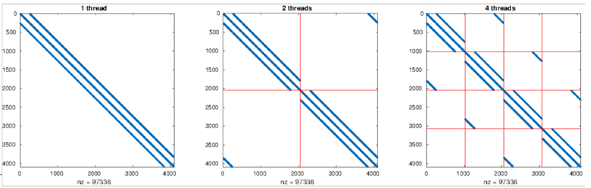
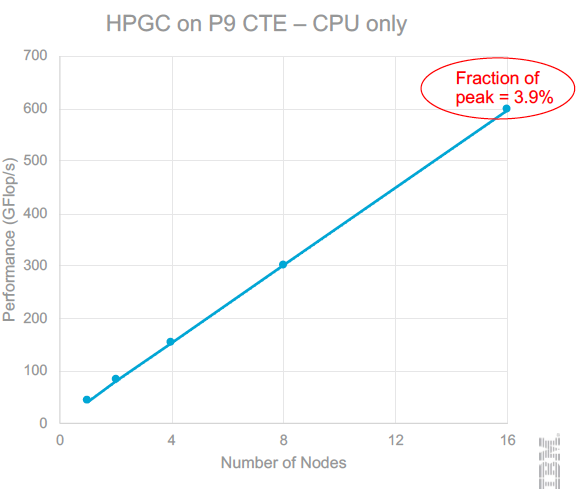

# IBM Optimized High Performance Conjugate Gradient

## Introduction ##
HPCG is a software package that performs a fixed number of multigrid preconditioned
(using a symmetric Gauss-Seidel smoother) conjugate gradient (PCG) iterations.

The original code is located at:    
https://github.com/hpcg-benchmark/hpcg/

We present here an optimized CPU-only version of HPCG on IBM processors. It features the following optimizations and code modifications:
- explicit SIMD vectorization, data prefetching, asynchronous MPI communication;
- smart pivoting: new OpenMP parallelization approach for SYMGS, the most time consuming kernel of HPCG.

Additionally, we fine tuned several parameters, such as:
- Local problem size;
- Number of MPI tasks and OpenMP threads;
- Compiler flags.

The code achieves 1.6% of the peak performance on **IBM BG/Q** and 3.9% on **IBM POWER9**.

## Optimizations ##
### Smart pivoting for parallel SYMGS
A parallel implementation of SYMGS requires coloring. This has two undesired side effects: 
- it slows down convergence; 
- it limits cache reuse.

Our proposed solution is to expoit the stencil discretization pattern, by pivot blocks of the matrix. This leads to a matrix structure that fits very well the SYMGS compute pattern. The idea of this approach is illustrated in the following image.

Non-blocking thread parallelism can be achieved, by simply assigning each thread to a block of rows.

### Fine tuning optimizations
- AXPY and DOT manually SIMD vectorized (slightly better performances than auto-compiled versions);
- Manual unrolling factor of 2 for SpMV, and slightly improved code;
- Contiguous storage for matrix (to help hardware prefetching);
- Improve backward prefetching of Gauss-Seidel smoother with `__dcbt` instructions;
- Use `Isend/Irecv` with a single `MPI_Waitall` call at the end (better overlap of communications).

#### IBM BG/Q optimizations
- XLC BG/Q compilers, with strong compiler optimizations (-O5, -qipa=level=2, -qhot=level=2, etc) 
- MPI configuration:
  - Two tasks per core
- OpenMP configuration:
  - Two threads per task
- Problem size:
  - A smaller problem size gives better MG and SPMV performance (better cache use). However it also increases DOT `MPI_Allreduce` (due to wait time)
  - For best results local domain should be set to `48x16x16` or `56x16x16` (on few racks) and `96x32x32` or `112x32x32` (on many racks)

#### IBM POWER9 optimizations
- POWER9 XLC (16.1.0) compiler, with same similar compiler optimizations as for BG/Q
- MPI configuration:
  - One task per core
  - Binding policy: `mpirun --bind–to core --map-by core`
- OpenMP configuration:
  - two threads per task (core)
  - `OMP_PROC_BIND=FALSE` (no explicit binding to the hardware threads of the core)
  - `OMP_WAIT_POLICY=ACTIVE` (no need for yield)
- Problem size
  - Local domain is set to `160x160x96` (or `160x96x160`)
  - Larger than BG/Q due to higher memory bandwidth

## Results
### Vulcan @ LLNL (BG/Q)
- https://www.top500.org/system/177732
- 24K nodes
- 32 MPI tasks/node, 2 threads each
- Local domain dimension: 112x32x32
- 80.9 TFlop/s (3.29 GFlop/s per node)
- Fraction of peak performance: 1.6%

### Sequoia @ LLNL (BG/Q)
- https://www.top500.org/system/177556
- 96K nodes
- 32 MPI tasks/node, 2 threads each
- Local domain dimension: 112x32x32
- 330.4 Tflop/s (3.36 GFlop/s per node)
  - #10 in HPGC results list (June 2018)
- Fraction of peak performance: 1.6%

### Marenostrum P9 CTE @ BSC (Power9)

#### System overview
- https://www.top500.org/system/179442
  - #255 in TOP500 (June 2018)
- 54 nodes organized in 3 racks
- 52 compute and 2 login nodes
- Each node:
 - 2x IBM POWER9 20C 3.1GHz
 - 40 cores with four-way multithreading variant SMT4
 - 4x NVIDIA Tesla V100
- Interconnection network: Dual-rail Mellanox EDR Infiniband

#### Experiments
- 32 nodes
- 40 MPI tasks/node, 2 threads each
- Local domain dimension: 160x160x96
- 1193.4 GFlop/s (37.3 GFlop/s per node)
- Fraction of peak: > 3% (depends on the actual core frequency)

## Installation and testing ##
You can read the general instructions provided in the file `INSTALL` in this directory.

According to them, you can create a custom directory, ``build`` in
this example, for the results of compilation and linking:

    mkdir build

Next, go this new directory and use the ``configure`` script to create the
build infrastructure:

    cd build
    ./configure <arch>

For IBM platforms, `<arch>` can be `bgq`, `p8` or `p9`, for IBM BG/Q, IBM POWER8 and POWER9 respectively.

You do not have to modify any of the compile time options that have been already set.
The optimized HPCG version is compiled with MPI and OpenMP enabled.

## BOF presentation at SC18
The performance results of the optimized HPCG version on IBM Power9 were presented at a [BOF session at SC18]( https://www.hpcg-benchmark.org/custom/index.html?lid=154&slid=298).
The presentation slides are available here: [Porting Optimized HPCG 3.1 for IBM BG/Q to IBM POWER9](https://www.hpcg-benchmark.org/downloads/sc18/HPCG_IBM_P9_v05.pdf).

## Authors and contacts
 - Cristiano Malossi, IBM Research - Zurich, acm@zurich.ibm.com
 - Panagiotis Chatzidoukas, IBM Research - Zurich, hat@zurich.ibm.com
 - Costas Bekas, IBM Research - Zurich, bek@zurich.ibm.com

## Acknowledgments
We acknowledge Scott Futral and Roy Musselman at LNCC for the great support in running the experiments on Vulcan and Sequoia. We also acknowledge the Marenostrum Team at Barcelona Supercomputing Center for allowing us to run the experiments on the full POWER9 system. Last but not least, we thank Jack Dongarra, Mike Heroux, and Piotr Luszczek for the HPCG initiative and support.  
